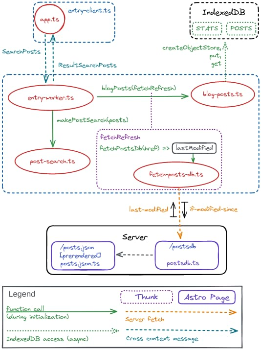
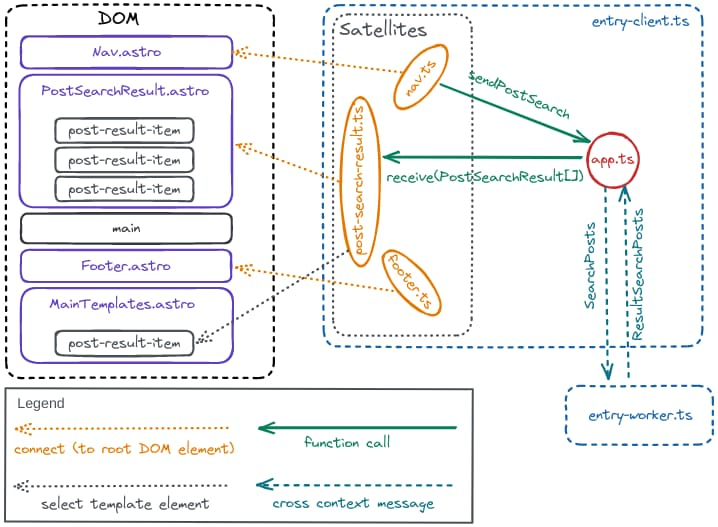

# Demo/Spike: Astro Component Satellites

Illustration of an approach that augments Astro components with client side functionality.

All it really takes is placing the client code entry point into a script tag inside the base layout:

```Astro
---
// file: src/layouts/MainLayout.astro
// front matter …
---

<html lang="en">
<HeadLayout {title} {description} />
  <body>
    <!-- More stuff -->
    <script>
      import { rendezvous } from '../client/entry-client';
      rendezvous();
    </script>
  </body>
</html>
```

… but before getting into details …

---

```shell
$ cd demo-astro-satellites-spike
$ npm i

added 434 packages, and audited 435 packages in 3s

172 packages are looking for funding
  run `npm fund` for details

found 0 vulnerabilities
$ npm run format

> demo-astro-satellites-spike@0.0.0 format
> prettier --write .

.prettierrc.json 47ms

 …

tsconfig.worker.json 3ms
$ npm run lint:types

> demo-astro-satellites-spike@0.0.0 lint:types
> astro check && tsc --noEmit

09:11:59 p.m. [check] Checking files
09:12:00 p.m. [content] Types generated 403ms
✔  Getting diagnostics for Astro files in /demo-astro-satellites-spike/…
09:12:02 p.m. [diagnostics] Result (11 files):
- 0 errors
- 0 warnings
- 0 hints

$ npm run worker:types

> demo-astro-satellites-spike@0.0.0 worker:types
> ./node_modules/.bin/tsc --noEmit -p ./tsconfig.worker.json

$ npm run worker:build

> demo-astro-satellites-spike@0.0.0 worker:build
> node bundle-worker.mjs

$ npm run dev

> demo-astro-satellites-spike@0.0.0 dev
> astro dev

  🚀  astro  v2.4.4 started in 61ms

  ┃ Local    http://localhost:3000/
  ┃ Network  use --host to expose

09:12:50 p.m. [content] Watching src/content/ for changes
09:12:50 p.m. [content] Types generated
09:12:50 p.m. [astro] update /.astro/types.d.ts

 …

term2 $ cd demo-astro-satellites-spike
term2 $ npm run save:posts

> demo-astro-satellites-spike@0.0.0 save:posts
> node --no-warnings save-posts.mjs

“http://localhost:3000/posts.json” saved to “./dev-posts.json”
Current 'last-modified' value: «Wed, 10 May 2023 01:13:50 GMT»

term2 $
```

---

- [Commands](#commands)
- [Project Structure](#project-structure)
- [Using a Web Worker to Offload Work from the Main Thread](#using-a-web-worker-to-offload-work-from-the-main-thread)
  - [Persisting Data Across Pages](#persisting-data-across-pages)
  - [Fetching Fresh Search Data](#fetching-fresh-search-data)
  - [Posts Data Server Endpoint](#posts-data-server-endpoint)
  - [Posts Data Static Endpoint](#posts-data-static-endpoint)
  - [Serving Main Thread Search Requests](#serving-main-thread-search-requests)
  - [The Worker Core](#the-worker-core)
- [The Satellites (Fragments)](#the-satellites-fragments)
  - [Footer Fragment](footer-fragment)
  - [Nav Fragment](#nav-fragment)
  - [Post Search Result Fragment](#post-search-result-fragment)
- [The (Client) App](#the-client-app)

## Commands

| Command                | Action                                                                                          |
| :--------------------- | :---------------------------------------------------------------------------------------------- |
| `npm run worker:types` | Type check worker code                                                                          |
| `npm run worker:build` | Bundle worker                                                                                   |
| `npm run lint:types`   | Type check server and client main thread code                                                   |
| `npm run dev`          | Starts local dev server at `localhost:3000`                                                     |
| `npm run save:posts`   | Save `/posts.json` static endpoint to `./dev-posts.json` file<br>for `/postsdb` server endpoint |

## Project Structure

```
/
├── README.md
│
├── tsconfig.json
├── tsconfig.worker.json
├── astro.config.mjs
│
├── bundle-worker.mjs
├── save-posts.mjs
├── dev-posts.json
│
├── public
│   ├── avatar.svg
│   └── favicon.svg
└── src
    ├── env.d.ts
    ├── index.d.ts
    ├── route-path.ts
    ├── schemas.ts
    ├── content
    │   ├── config.ts
    │   └── blog
    │       ├── post-1.md
    │       ├── post-2.md
    │       ├── post-3.md
    │       ├── post-4.md
    │       ├── post-5.md
    │       ├── post-6.md
    │       └── post-7.md
    ├── layouts
    │   ├── HeadLayout.astro
    │   └── MainLayout.astro
    ├── components
    │   ├── Footer.astro
    │   ├── Nav.astro
    │   ├── PostResultItem.astro
    │   └── PostSearchResult.astro
    ├── templates
    │   └── MainTemplates.astro
    ├── pages
    │   ├── index.astro
    │   ├── posts.json.ts
    │   ├── postsdb.ts
    │   ├── blog
    │   │   ├── index.astro
    │   │   └── post.astro
    │   └── about.astro
    └── client
        ├── entry-client.ts
        ├── entry-worker.ts
        ├── search-messages.ts
        ├── app-types.ts
        ├── shame.ts
        ├── app.ts
        ├── search-client.ts
        ├── fragments (satellites)
        │   ├── footer.ts
        │   ├── nav.ts
        │   └── post-search-result.ts
        └── worker
            ├── types.ts
            ├── blog-posts.ts
            ├── fetch-posts-db.ts
            └── post-search.ts
```

## Using a Web Worker to Offload Work from the Main Thread.

This [Web Worker](https://developer.mozilla.org/en-US/docs/Web/API/Web_Workers_API) is responsible for handling the blog post search data and performing searches. Consequently the main thread doesn't have to fetch the search data nor perform any searches against the data. So the main thread isn't bogged down with the loading and parsing of search functionality and data on first load.



### Persisting Data Across Pages

The browser's [IndexedDB](https://developer.mozilla.org/en-US/docs/Web/API/IndexedDB_API) can store data that can be [structurally cloned](https://developer.mozilla.org/en-US/docs/Web/API/structuredClone) (like [`Date`](https://developer.mozilla.org/en-US/docs/Web/JavaScript/Reference/Global_Objects/Date)). The IndexedDB API is event based as it was introduced before promises were standardized. Using [`idb`](https://github.com/jakearchibald/idb) smoothes over those rough edges.

```TypeScript
// file: src/client/worker/blog-posts
import { openDB } from 'idb';
import type { DBSchema, IDBPDatabase, OpenDBCallbacks } from 'idb';
import type { Post } from '../../schemas';
import type { FetchRefresh, RefreshReturn } from './types';

const DB_NAME = 'BLOG_STORE';
const STATS_STORE_NAME = 'STATS';
const POSTS_STORE_NAME = 'POSTS';
const DB_VERSION = 1;

interface BlogDB extends DBSchema {
  STATS: {
    key: string;
    value: {
      lastModified: string;
    };
  };
  POSTS: {
    key: string;
    value: {
      posts: Post[];
    };
  };
}

// Store Date objects in IndexedDB
function reviver(key: string, value: unknown) {
  if (key === 'date' && typeof value === 'string' && value.length > 0) {
    return new Date(value);
  }
  return value;
}

async function refreshPosts(
  db: IDBPDatabase<BlogDB>,
  refresh: RefreshReturn | undefined
) {
  if (refresh && refresh.kind === 'refresh') {
    // Update stores
    const holder = JSON.parse(refresh.payload, reviver) as { posts: Post[] };
    await db.put(POSTS_STORE_NAME, holder, POSTS_STORE_NAME);
    if (refresh.lastModified) {
      await db.put(
        STATS_STORE_NAME,
        { lastModified: refresh.lastModified },
        POSTS_STORE_NAME
      );
    }
    return holder.posts;
  }

  // Get stored Posts
  const holder = await db.get(POSTS_STORE_NAME, POSTS_STORE_NAME);
  return holder ? holder.posts : ([] as Post[]);
}

type Upgrade = OpenDBCallbacks<BlogDB>['upgrade'];

const upgrade: Upgrade = (db: IDBPDatabase<BlogDB>) => {
  db.createObjectStore(STATS_STORE_NAME);
  db.createObjectStore(POSTS_STORE_NAME);
};

async function blogPosts(fetchRefresh: FetchRefresh) {
  let db: IDBPDatabase<BlogDB> | undefined;
  let posts: Post[] = [];
  try {
    db = await openDB<BlogDB>(DB_NAME, DB_VERSION, {
      upgrade,
    });

    const stats = await db.get(STATS_STORE_NAME, POSTS_STORE_NAME);
    const refresh = await fetchRefresh(stats ? stats.lastModified : undefined);
    posts = await refreshPosts(db, refresh);
  } finally {
    if (db) db.close();
  }

  return posts;
}

export { blogPosts };

```

- `blogPosts` opens the database to retrieve the statistics (`last-modified` date) before performing `fetchRefresh()`.
  - The response will contain the post data if it is more recent. `refreshPosts()` first updates the database and then returns the data.
  - Otherwise the response will be empty. `refreshPosts()` retrieves the data from the database and returns it.

IndexedDB is closed as it has served it's purpose.

### Fetching Fresh Search Data

```TypeScript
// file: src/client/worker/fetch-posts-db.ts
import type { Refresh, RefreshFail } from './types';

async function fetchPostsDb(href: string, lastModified?: string) {
  const headers: Record<string, string> = {
    accept: 'application/json',
  };
  if (lastModified) headers['if-modified-since'] = lastModified;

  const options = {
    method: 'GET',
    headers,
  };

  const response = await fetch(href, options);

  if (response.status === 304) {
    // Not Modified
    return undefined;
  }

  if (!response.ok)
    return {
      kind: 'fail',
      code: response.status,
      message: response.statusText,
    } as RefreshFail;

  const currentLastModified = response.headers.get('last-modified');
  const payload = await response.text();
  return {
    kind: 'refresh',
    lastModified: currentLastModified,
    payload,
  } as Refresh;
}

export { fetchPostsDb };
```

- `Refresh` and `RefreshFail` are two distinct types of the [discriminated union](https://www.typescriptlang.org/docs/handbook/2/narrowing.html#discriminated-unions) `RefreshReturn`.
- `fetchPostsDb()` places a [`if-modified-since`](https://developer.mozilla.org/en-US/docs/Web/HTTP/Headers/If-Modified-Since) header with the request.
  - A [`200 OK`](https://developer.mozilla.org/en-US/docs/Web/HTTP/Status/200) response contains fresh data which is returned with the more recent [`last-modified`](https://developer.mozilla.org/en-US/docs/Web/HTTP/Headers/Last-Modified) value.
  - A [`304 Not Modified`](https://developer.mozilla.org/en-US/docs/Web/HTTP/Status/304) response is empty and `undefined` is returned.

### Posts Data Server Endpoint

```TypeScript
// file: src/pages/postsdb.ts
import type { APIContext } from 'astro';
import { stat, readFile } from 'node:fs/promises';

// CAUTION: `dev` file only. To create:
// `$ npm run save:posts` while `$ npm run dev`

const PATH = './dev-posts.json';

const toLastModifiedValue = (mtimeMs: number) =>
	new Date(Math.trunc(mtimeMs)).toUTCString();

export async function get({ request }: APIContext) {
	const dataStat = await stat(PATH);
	const lastModifiedValue = toLastModifiedValue(dataStat.mtimeMs);

	const clientLastModified = (request.headers as Headers).get(
		'if-modified-since'
	);
	if (clientLastModified === lastModifiedValue) {
		return new Response(null, {
			status: 304,
			statusText: 'Not Modified',
		});
	}

	const headers = {
		'last-modified': lastModifiedValue,
		'content-type': 'application/json;charset=utf-8',
	};

	const body = await readFile(PATH);

	return new Response(body, {
		status: 200,
		statusText: 'OK',
		headers,
	});
}
```

- The endpoint accesses the file that contains the latest **generated** set of post data. First it simply accesses the last modified time.
  - A [`304 Not Modified`](https://developer.mozilla.org/en-US/docs/Web/HTTP/Status/304) empty response is returned provided the last modified time matches with the value sent in the client [`if-modified-since`](https://developer.mozilla.org/en-US/docs/Web/HTTP/Headers/If-Modified-Since) header.
  - Otherwise a [`200 OK`](https://developer.mozilla.org/en-US/docs/Web/HTTP/Status/200) response with the file's data and a matching [`last-modified`](https://developer.mozilla.org/en-US/docs/Web/HTTP/Headers/Last-Modified) header is returned to the client.

### Posts Data Static Endpoint

```TypeScript
// file: src/pages/posts.json.ts
import { getCollection, type CollectionEntry } from 'astro:content';
import { slugToBlogHref, toAuthorHref, toCategoryHref } from '../route-path';
import type { PostPersisted } from '../schemas';

export const prerender = true;

const toPost = ({
  data: { title, category, description, author, date, draft },
  body,
  slug,
}: CollectionEntry<'blog'>) => {
  const post: PostPersisted = {
    title,
    category: [toCategoryHref(category), category],
    description,
    author: [toAuthorHref(author), author],
    date,
    draft,
    content: body,
    slug: slugToBlogHref(slug),
  };
  return post;
};

export async function get() {
  const entries = await getCollection('blog');
  const body = JSON.stringify({
    posts: entries.map(toPost),
  });
  return { body };
}

```

The posts are obtained with [`getCollection()`](https://docs.astro.build/en/reference/api-reference/#getcollection) ([`CollectionEntry`](https://docs.astro.build/en/reference/api-reference/#collection-entry-type) type), transformed to `PostPersisted` and returned for static render (note: `export const prerender = true`). See also [Static File Endpoints](https://docs.astro.build/en/core-concepts/endpoints/#static-file-endpoints).

For development the following script captures the `./dev-posts.json` file for the `/postsdb` [Server Endpoint](https://docs.astro.build/en/core-concepts/endpoints/#server-endpoints-api-routes). The script is run with `npm run save:posts`.

```JavaScript
// file: ./save-posts.mjs
import { stat, writeFile } from 'node:fs/promises';

const RESOURCE_HREF = 'http://localhost:3000/posts.json';
const TARGET_PATH = './dev-posts.json';

const toLastModifiedValue = (mtimeMs) =>
  new Date(Math.trunc(mtimeMs)).toUTCString();

function exitWithError(error) {
  const message =
    error instanceof Error
      ? error.message
      : typeof error === 'string'
      ? error
      : undefined;
  if (message) console.error(message);

  console.log(
    'Usage example: $ node save-posts.mjs\nwhile `$ npm run dev` in another terminal'
  );
  process.exit(1);
}

try {
  const response = await fetch(RESOURCE_HREF);
  if (!response.ok) {
    throw new Error(
      `HTTP error status (${response.status}): ${response.statusText}`
    );
  }
  const data = await response.text();
  await writeFile(TARGET_PATH, data);

  console.log(`“${RESOURCE_HREF}” saved to “${TARGET_PATH}”`);

  const dataStat = await stat(TARGET_PATH);
  const lastModified = toLastModifiedValue(dataStat.mtimeMs);

  console.log(`Current 'last-modified' value: «${lastModified}»`);
} catch (e) {
  exitWithError(e);
}
```

### Serving Main Thread Search Requests

The main and worker thread communicate with the following messages. Note that both the `Request` and `Result` have an `id`—a [correlation identifier](https://www.enterpriseintegrationpatterns.com/patterns/messaging/CorrelationIdentifier.html), i.e. it correlates the `Result` to the original `Request`.

```TypeScript
// file: src/client/search-messages.ts
import { nanoid } from 'nanoid';
import type { PostSearchResult } from '../schemas';

export type SearchPosts = {
  kind: 'post-search';
  id: string;
  term: string;
};

export type ResultSearchPosts = {
  kind: 'post-search';
  id: string;
  results: PostSearchResult[];
};

// Requests: Main ➔  Worker
export type Requests = SearchPosts;
// Results: Worker ➔  Main
export type Results = ResultSearchPosts;

const request = {
  searchPosts(term: string) {
    const message: SearchPosts = {
      kind: 'post-search',
      id: nanoid(),
      term,
    };
    return message;
  },
};

const result = {
  searchPosts(request: SearchPosts, results: PostSearchResult[]) {
    const message: ResultSearchPosts = {
      kind: 'post-search',
      id: request.id,
      results,
    };
    return message;
  },
};

export { request, result };
```

`post-search` exports a factory function that wraps the passed posts into a search function.

```TypeScript
// file: src/client/worker/post-search.ts
import Fuse from 'fuse.js';
import type { PostPersisted, PostSearchResult } from '../../schemas';

function toPostSearchResult({
  item: { slug, title, category, description, author, date },
}: Fuse.FuseResult<PostPersisted>) {
  const result: PostSearchResult = {
    slug,
    title,
    category,
    description,
    author,
    date,
  };

  return result;
}

function makePostSearch(posts: PostPersisted[]) {
  const fuse = new Fuse(posts, {
    keys: ['title', 'author', 'category', 'description', 'content'],
    shouldSort: true,
    minMatchCharLength: 1,
    threshold: 0.3,
  });

  return function search(term: string) {
    const results = fuse.search(term);
    return results.map(toPostSearchResult);
  };
}

export { makePostSearch };
```

### The Worker Core

```TypeScript
/// <reference lib="webworker" />
// file: src/client/entry-worker.ts
import { fetchPostsDb } from './worker/fetch-posts-db';
import { blogPosts } from './worker/blog-posts';
import { makePostSearch } from './worker/post-search';
import { result, type Requests } from './search-messages';
import type { PostPersisted } from '../schemas';

type Search = ReturnType<typeof makePostSearch>;

let serve: ((request: Requests) => void) | undefined;
const requests: Requests[] = [];

function isWorker(value: unknown): asserts value is DedicatedWorkerGlobalScope {
  let record =
    value && typeof value === 'object'
      ? (value as Record<string, unknown>)
      : undefined;

  if (!(record && typeof record['close'] === 'function'))
    throw new Error('Not a Worker');
}

function handleRequest(search: Search, request: Requests) {
  switch (request.kind) {
    case 'post-search': {
      const posts = search(request.term);
      const response = result.searchPosts(request, posts);
      self.postMessage(response);
    }
  }
}

function handleMessage(event: MessageEvent<Requests>) {
  if (serve) {
    serve(event.data);
    return;
  }

  requests.push(event.data);
}

const keepPublished = (before: number) => (post: PostPersisted) =>
  !post.draft && post.date.getTime() <= before;

(async function start() {
  isWorker(self);

  if (typeof self['indexedDB'] !== 'object') {
    console.log("This worker doesn't support IndexedDB");
    self.close();
  }

  // Try not to miss any requests
  self.addEventListener('message', handleMessage);

  const refreshHref = self.location.origin + '/postsdb';
  const posts = await blogPosts((lastModified?: string) =>
    fetchPostsDb(refreshHref, lastModified)
  );

  const publishedPosts = posts.filter(keepPublished(Date.now()));
  const search = makePostSearch(publishedPosts);
  const requestHandler = (request: Requests) => handleRequest(search, request);

  // Process any accumulated request(s) (to preserve processing sequence)
  if (requests.length > 0) {
    const current = requests.slice();
    requests.length = 0;
    current.forEach(requestHandler);
  }

  // Now handle each request as it arrives
  serve = requestHandler;
})();
```

- The `isWorker` [assertion function](https://www.typescriptlang.org/docs/handbook/release-notes/typescript-3-7.html#assertion-functions) primarily exists to convince TypeScript that it's OK to access `self` and other properties of the [`DedicatedWorkerGlobalScope`](https://developer.mozilla.org/en-US/docs/Web/API/DedicatedWorkerGlobalScope).

- Oddly enough [IndexedDB](https://developer.mozilla.org/en-US/docs/Web/API/IndexedDB_API#sect1) isn't accessible through `self` even though it's clearly documented that Web Workers support it.

- At the earliest possible moment a message handler is attached so that no requests from the main thread will be missed. While `serve` isn't available, requests are just pushed onto the `requests` module global array.

- The blog posts are obtained via the `blog-post` module (as described previously in [Persisting Data Across Pages](#persisting-data-across-pages)).

- The search function is created with the all published posts which is injected into the `requestHandler()`.

- Any pending `requests` are processed.

- Finally the `serve` module global is set so that `handleMessage` can route future requests for immediate processing.

The worker is bundled by the following script ([esbuild](https://esbuild.github.io/api/#build)):

```JavaScript
// file: ./bundle-worker.mjs
import { build } from 'esbuild';

await build({
  entryPoints: ['./src/client/entry-worker.ts'],
  bundle: true,
  minify: true,
  format: 'iife',
  tsconfig: 'tsconfig.worker.json',
  outfile: './public/search-worker.js',
});
```

## The Satellites (Fragments)



Ideally using [Astro Islands](https://docs.astro.build/en/concepts/islands/) with the [SolidJS integration](https://docs.astro.build/en/guides/integrations-guide/solid-js/) should lead to lightweight, yet performant client side interactivity. However the point of this spike (aka [tracer bullets](https://wiki.c2.com/?TracerBullets)) is _to bolt client interactivity onto Astro Components_.

To make matters a little bit easier the [`regular-elements`](https://github.com/WebReflection/regular-elements) library is used. It exposes an API similar to the [`CustomElementRegistry`](https://developer.mozilla.org/en-US/docs/Web/API/CustomElementRegistry). However the `define()` function accepts a specification object (`RegularElementOptions`) instead of a [CustomElement](https://developer.mozilla.org/en-US/docs/Web/API/Web_components/Using_custom_elements).

> A [specification object](https://gist.github.com/benpriebe/55b7e950b5e9d056b47e?permalink_comment_id=2229105#gistcomment-2229105) is a configurations/customizations "bag" that is passed to a factory or builder function to configure and/or customize the item under assembly. Douglas Crockford also called them _Object Specifiers_ in _JavaScript: The Good Parts_. The term was also used in the [original](https://shripadk.github.io/react/docs/top-level-api.html#react.createclass) React documentation:
>
> > `function createClass(object specification)` Create a component given a **specification**. … For more information about the **«specification object»**, see [Component Specs and Lifecycle](https://shripadk.github.io/react/docs/component-specs.html).

```TypeScript
// file: src/index.d.ts
declare module 'regular-elements' {
  export interface RegularElementsOptions {
    connectedCallback?(this: Element): void;
    disconnectedCallback?(this: Element): void;
    attributeChangedCallback?(
      this: Element,
      attributeName: string,
      oldValue: string,
      newValue: string
    ): void;
    observedAttributes?: string[];
  }

  export function define(
    selector: string,
    options: RegularElementsOptions
  ): void;

  export function get(selector: string): RegularElementsOptions;

  export function whenDefined(
    selector: string
  ): Promise<RegularElementsOptions>;
}
```

`connectedCallback()` and `disconnectedCallback()` are of primary importance.

- `connectedCallback()` is invoked when an element with the matching selector is mounted on the DOM. This is where event handlers can be added to the existing DOM.
- `disconnectedCallback()` is invoked when the element is dismounted from the DOM. Event handlers can be removed and cleanup tasks initiated.
- The root [Element](https://developer.mozilla.org/en-US/docs/Web/API/Element) is passed as `this` ([Function context](https://developer.mozilla.org/en-US/docs/Web/JavaScript/Reference/Operators/this#function_context)). To track any kind of state in connection to that root, the `this` reference can be used as a key to a [`Map`](https://developer.mozilla.org/en-US/docs/Web/JavaScript/Reference/Global_Objects/Map) which holds a binder object as a value.

The simplest implementation of a fragment is the …

### Footer Fragment

```TypeScript
// file: src/client/fragments/footer.ts
import type { RegularElementsOptions as Spec } from 'regular-elements';

const NAME = 'js\\:f-footer';

const spec: Spec = {
  connectedCallback(this: Element) {
    const span = this.querySelector('#copyright');
    if (span) span.textContent = new Date().getFullYear().toString();
  },
};

export { NAME, spec };
```

It simply overwrites the statically generated copyright year with the client's current year once the footer is mounted. The `NAME` `js\:f-footer` is also used to create a [class selector](https://developer.mozilla.org/en-US/docs/Web/CSS/Class_selectors) to target the root `Element`.

The `js` prefix identifies the class as a [JavaScript hook](https://cssguidelin.es/#javascript-hooks). It expresses that the class is used by JavaScript so

- it shouldn't be arbitrarily renamed during CSS refactoring
- it shouldn't be used as a general styling target as JavaScript may remove the class.

To avoid this prefix some developers like to use [custom data attributes](https://developer.mozilla.org/en-US/docs/Web/HTML/Global_attributes/data-*) instead. However as [this](https://cssguidelin.es/#data--attributes) points out [3.2.6.6 Embedding custom non-visible data with the data-\* attributes](https://html.spec.whatwg.org/multipage/dom.html#embedding-custom-non-visible-data-with-the-data-*-attributes) states:

> Custom data attributes are intended to **store custom data**, state, annotations, and similar, private to the page or application,

i.e. “custom data attributes are designed to store data, _not be bound to_.”

The reverse solidus ("`\\`") is necessary so that "`:`" can be used in a class name which itself delimits the JS hook prefix from the "`f`" prefix which identifies it as a fragment class name.

### Nav Fragment

Unlike the Footer fragment the Nav fragment has a dependency, the `SendPostSearch` function which dispatches the search term to the core application.

- In order to capture that dependency the `Spec` is no longer a static module global. Instead the `Spec` is dynamically created with `makeSpec(send: SendPostSearch)` which makes it possible to inject the dependency.
- In this case there will only ever be one single `nav` fragment. However in the general case, multiple instances of a fragment could be active simultaneously. The `Binder` class tracks the state for each instance separately. All `Binder` instances are tracked by the `instances` [`WeakMap`](https://developer.mozilla.org/en-US/docs/Web/JavaScript/Reference/Global_Objects/WeakMap) in the `Spec`'s closure.
- Nav's `Binder` tracks the `root` of the `Nav` DOM subtree, the search term `<input>` element within it, and the `send` dispatch to the core application.

```TypeScript
// file: src/client/fragments/nav.ts
import type { RegularElementsOptions as Spec } from 'regular-elements';
import type { SendPostSearch } from '../app-types';

const NAME = 'js\\:f-nav';

class Binder {
  constructor(
    public readonly root: HTMLElement,
    public readonly searchRef: HTMLInputElement,
    public readonly send: SendPostSearch
  ) {}

  handleEvent(event: Event) {
    switch (event.type) {
      case 'input': {
        if (event.target !== this.searchRef) return;

        this.send(this.searchRef.value.trim());
        event.preventDefault();
        event.stopPropagation();
      }
    }
  }
}

function makeSpec(send: SendPostSearch) {
  const instances = new WeakMap<Element, Binder>();

  function connectedCallback(this: Element) {
    if (!(this instanceof HTMLElement)) return;

    const searchRef = this.querySelector('input');
    if (!(searchRef instanceof HTMLInputElement)) return;

    const binder = new Binder(this, searchRef, send);
    instances.set(this, binder);
    binder.searchRef.addEventListener('input', binder);
  }

  function disconnectedCallback(this: Element) {
    const binder = instances.get(this);
    if (!binder) return;

    binder.searchRef.removeEventListener('input', binder);
    instances.delete(this);
  }

  const spec: Spec = {
    connectedCallback,
    disconnectedCallback,
  };

  return spec;
}

export { NAME, makeSpec };
```

- `Binder` also has a[`handleEvent()`](https://gist.github.com/WebReflection/35ca0e2ef2fb929143ea725f55bc0d63) ([MDN](https://developer.mozilla.org/en-US/docs/Web/API/EventTarget/addEventListener#specifying_this_using_bind:~:text=Another%20solution%20is%20using%20a%20special%20function%20called%20handleEvent), [interface `EventListener` (object)](https://dom.spec.whatwg.org/#interface-eventtarget)) method that allows the `Binder` object itself to be used as an [`EventListener`](http://web.archive.org/web/20220221051208/https://developer.mozilla.org/en-US/docs/Web/API/EventListener). One single `handleEvent()` function, shared amongst all the `Binder` instances can now route the event traffic of all the class's objects.
- In `connectedCallback()` the `Binder` instance is added as the listener to the search `<input>`'s [input event](https://developer.mozilla.org/en-US/docs/Web/API/HTMLElement/input_event). Whenever the element's `value` changes, the search term is dispatched with the app's `SendPostSearch` function.
- In `disconnectedCallback()` the listener is removed and the `Binder` is deleted from the `instances` map.

### Post Search Result Fragment

The `post-search-result` fragment actually has _to render something client side_. In this particular case the equivalent content never has to be rendered server side so the template could be collocated with the fragment. Here we proceed as if the template is needed on _both_ the server and the client.

```Astro
---
// file src/templates/MainTemplates.astro
import PostResultItem from '../components/PostResultItem.astro';
---

<template id="post-result-item">
  <PostResultItem />
</template>
```

The intent behind `MainTemplates.astro` is that the `MainTemplates` component collects all the templates that may be needed by pages rendered with `MainLayout`, so that `MainLayout` can include them in one fell swoop. `MainTemplates` is responsible for applying the `id`s that fragments will use.

```Astro
<li class="post-result-item">
  <article class="post-result-card">
    <small>
      <a class="js-category" href="#"></a>
    </small>
    <div class="post-result-card__content">
      <div>
        <h3>
          <a class="js-title"></a>
        </h3>
        <small>
          {'by '}
          <a class="js-author" href="#"></a>
        </small>
      </div>
      <p class="js-description"></p>
      <a class="js-link" href="#">
        <span>Read Post</span>
      </a>
    </div>
  </article>
</li>
```

The `PostResultItem` isn't particularly complicated given that it doesn't have to function both as a server side template and a template body for a client side template. Generally the "no props" version should emit the variation to be placed inside a [`<template>` element](https://developer.mozilla.org/en-US/docs/Web/HTML/Element/template).

The `js-category`, `js-title`, `js-author`, `js-description`, and `js-link` hooks exist only to make it easier to target those elements that need to be "filled".

```TypeScript
// file: src/client/fragments/post-search-result.ts
import { formatDateForPost } from '../shame';

import type { RegularElementsOptions as Spec } from 'regular-elements';
import type { SinkPostSearchResult } from '../app-types';
import type { PostSearchResult } from '../../schemas';

const NAME = 'js\\:f-post-search-result';
const TEMPLATE_ITEM_ID = 'post-result-item';

function getItemTemplate() {
  const template = document.getElementById(TEMPLATE_ITEM_ID);
  if (!(template instanceof HTMLTemplateElement))
    throw Error('post-result-item template not found');

  return template;
}

type Bind = {
  readonly root: HTMLUListElement;
  readonly itemTemplate: HTMLTemplateElement;
  readonly items: Map<string, HTMLLIElement>;
};

function fillPostResultItem(root: HTMLLIElement, post: PostSearchResult) {
  const category = root.querySelector('.js-category');
  if (category instanceof HTMLAnchorElement) {
    category.href = post.category[0];
    category.textContent = post.category[1];
  }

  const title = root.querySelector('.js-title');
  if (title instanceof HTMLAnchorElement) {
    title.textContent = post.title;
    title.href = post.slug;
  }

  const author = root.querySelector('.js-author');
  if (author instanceof HTMLAnchorElement) {
    author.href = post.author[0];
    author.textContent = post.author[1];

    const parent = author.parentNode;
    if (parent) {
      // "insertAfter()"
      parent.insertBefore(
        document.createTextNode(` ${formatDateForPost(post.date)}`),
        author.nextSibling
      );
    }
  }

  const description = root.querySelector('.js-description');
  if (description instanceof HTMLParagraphElement)
    description.textContent = post.description;

  const link = root.querySelector('.js-link');
  if (link instanceof HTMLAnchorElement) link.href = post.slug;

  return root;
}

function clonePostResultItem(
  template: HTMLTemplateElement,
  post: PostSearchResult
) {
  const root = template.content.firstElementChild;
  if (!(root instanceof HTMLLIElement))
    throw new Error('Unexpected post-result-item template root');

  return fillPostResultItem(root.cloneNode(true) as HTMLLIElement, post);
}

function renderResults(
  { root, itemTemplate, items }: Bind,
  results: PostSearchResult[]
) {
  const unusedKeys = new Set(items.keys());
  const nextChildren = [];

  for (const post of results) {
    // Find the previously rendered one if present
    const previous = items.get(post.slug);
    const element = previous
      ? previous
      : clonePostResultItem(itemTemplate, post);

    if (previous) unusedKeys.delete(post.slug);
    else items.set(post.slug, element);

    nextChildren.push(element);
  }

  // discard unused items
  for (const key of unusedKeys) items.delete(key);

  // toggle whether list needs to be part of the
  // rendered DOM
  if (items.size > 0) root.classList.remove('js-remove');
  else root.classList.add('js-remove');

  // place the next set of items
  root.replaceChildren.apply(root, nextChildren);
}

class Binder implements Bind {
  readonly root: HTMLUListElement;
  readonly itemTemplate: HTMLTemplateElement;
  readonly items: Map<string, HTMLLIElement>;
  readonly unsubscribe: () => void;

  constructor(
    sink: SinkPostSearchResult,
    itemTemplate: HTMLTemplateElement,
    root: HTMLUListElement
  ) {
    this.root = root;
    this.itemTemplate = itemTemplate;
    this.unsubscribe = sink(this.receive);
    this.items = new Map();
  }

  receive = (results: PostSearchResult[]) => {
    renderResults(this, results);
  };
}

function makeSpec(sink: SinkPostSearchResult) {
  const instances = new WeakMap<Element, Binder>();
  const itemTemplate = getItemTemplate();

  function connectedCallback(this: Element) {
    if (!(this instanceof HTMLUListElement)) return;

    const binder = new Binder(sink, itemTemplate, this);
    instances.set(this, binder);
  }

  function disconnectedCallback(this: Element) {
    const instance = instances.get(this);
    if (!instance) return;

    instance.unsubscribe();
    instances.delete(this);
  }

  const spec: Spec = {
    connectedCallback,
    disconnectedCallback,
  };

  return spec;
}

export { NAME, makeSpec };
```

- `getItemTemplate()` locates the template for later [cloning](https://developer.mozilla.org/en-US/docs/Web/API/Node/cloneNode).
- `clonePostResultItem()` clones the contents of the template and then fills it with `fillPostResultItem()`.
- `fillPostResultItem()` renders the data found in `post:PostSearchResult` into the cloned `root`.
- The `Binder` holds the fragment `root`, the `itemTemplate` to be cloned, a `Map` of cloned `items` and an `unsubscribe()` function to stop receiving `PostSearchResult[]` from the core app. The `constructor` subscribes (`sink`s) to `receive` the `PostSearchResult[]` data. `receive` routes the data to the `renderResults()` function.
- `renderResults()` renders the `results:PostResults[]` with the `itemTemplate` but "recycles" any relevant `items` from the `Map`. So while the first `results` may all require rendering, as the search continues to narrow already rendered items are simply reused or discarded.
- `connectedCallback()` adds a new `Binder` to the `instances` `Map`.
- `disconnectedCallback()` unsubscribes the `Binder` and removes it from `instances`.

### The (Client) App

`app-types.ts` is used to express the contracts between the `app.ts` module and the other supporting modules. That way the modules aren't directly tied to the other implementing modules (easier for testing). `entry-client.ts` is responsible for wiring the implementing modules together.

```TypeScript
// file: src/client/app-types.ts
import type { Results } from './search-messages';
import type { PostSearchResult } from '../schemas';

// Interfaces that have to be implemented BY
// the app's dependencies
export type MakeSearch = (cb: (result: Results) => void) => {
	searchPosts(term: string): string;
	terminate(): void;
};

// Interfaces implemented FOR
// dependencies of the app
export type SendPostSearch = (term: string) => void;
export type SinkPostSearchResult = (
	sinkFn: (results: PostSearchResult[]) => void
) => () => void;
```

- `MakeSearch` is implemented by `search-client` (which starts the web worker) for `app`.
- `SendPostSearch` is the only dependency that `nav` has on `app`.
- `SinkPostSearchResult` is the only dependency that `post-search-result` has on app.

```TypeScript
// file: src/client/entry-client.ts
import { define } from 'regular-elements';
import { makeSearchClient } from './search-client';
import { makeApp } from './app';
import * as nav from './fragments/nav';
import * as footer from './fragments/footer';
import * as postSearchResult from './fragments/post-search-result';

function rendezvous() {
  // 1. Create app (injecting dependencies)
  const app = makeApp(makeSearchClient);

  // 2. Wire up the fragment (aka satellite) modules
  // (injecting ONLY relevant dependencies
  // de-coupled via `app-types.ts`)
  //
  const navSpec = nav.makeSpec(app.sendPostSearch);
  const postSearchResultSpec = postSearchResult.makeSpec(
    app.sinkPostSearchResult
  );

  // 3. Wire up the DOM (with regular-elements)
  define('.' + nav.NAME, navSpec);
  define('.' + postSearchResult.NAME, postSearchResultSpec);
  define('.' + footer.NAME, footer.spec);
}

export { rendezvous };
```

The [`rendezvous()`](https://github.com/peerreynders/rendezvous) function makes everything [come together](#demospike-astro-component-satellites):

- Start by preparing any dependencies the core app may need. In this particular case nothing explicit is required.
- Create the core app while injecting its dependencies. Here invoking `MakeSearch` supplied by [`search-client.ts`](src/client/search-client.ts) will spin up the web worker and connect to it.
- With the `app` active, inject the specific services provided into the fragments (satellites) as they are prepared.
- Only at the end are the fragments registered with [regular-elements](https://github.com/WebReflection/regular-elements) allowing the fragments to take over the DOM and enabling interactivity.

```TypeScript
// file: src/client/app.ts
import type { Results } from './search-messages';
import type {
  MakeSearch,
  SendPostSearch,
  SinkPostSearchResult,
} from './app-types';
import type { PostSearchResult } from '../schemas';

class Sinks<V> {
  sinks = new Set<(value: V) => void>();

  add = (sink: (value: V) => void) => {
    const remove = () => void this.sinks.delete(sink);
    this.sinks.add(sink);
    return remove;
  };

  send = (value: V) => {
    for (const sink of this.sinks) sink(value);
  };
}

function makeApp(makeSearch: MakeSearch) {
  // Wire up for "post search"
  let lastSearch = '';
  const resultSinks = new Sinks<PostSearchResult[]>();
  const sinkPostSearchResult: SinkPostSearchResult = resultSinks.add;
  const receiveSearchResult = (result: Results) => {
    switch (result.kind) {
      case 'post-search': {
        // Only foward if this is result from the most recent search
        if (result.id !== lastSearch) return;

        resultSinks.send(result.results);
      }
    }
  };

  const search = makeSearch(receiveSearchResult);
  const sendPostSearch: SendPostSearch = (term: string) => {
    // Remember most recent search
    lastSearch = search.searchPosts(term);
  };

  return {
    sendPostSearch,
    sinkPostSearchResult,
  };
}

export { makeApp };
```

- Via `sendPostSearch()` a search `term` is received (from `nav`).
- The search `term` is dispatched to the web worker via `search.searchPosts`. The request `id` is saved in `lastSearch`.
- Eventually a [`ResultSearchPosts`](src/client/search-messages.ts) message will arrive from the web worker via `receiveSearchResult()`. If the [correlation identifer](https://www.enterpriseintegrationpatterns.com/patterns/messaging/CorrelationIdentifier.html) matches with that of the most recent request the `PostSearchResult[]` is sent to all the "sinks" (i.e. the `post-search-result` fragment). Otherwise the result is ignored (i.e. not rendered) as a more recent search is already under way.
